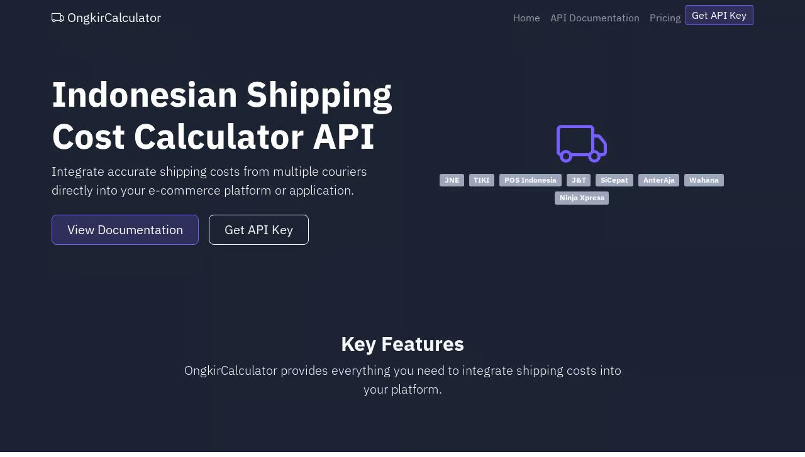

# OngkirCalculator API

OngkirCalculator adalah layanan API (Application Programming Interface) asal Indonesia yang menyediakan informasi ongkos kirim dari berbagai jasa ekspedisi seperti JNE, TIKI, POS Indonesia, J&T, SICEPAT, dan lainnya. OngkirCalculator memungkinkan pengembang aplikasi atau pemilik toko online untuk mengintegrasikan perhitungan ongkos kirim secara otomatis ke dalam sistem mereka—baik website e-commerce, marketplace, atau aplikasi logistik.



## Fitur Utama

- **Dukungan Multi Kurir**: Menghitung ongkos kirim dari berbagai jasa ekspedisi Indonesia dalam sekali API call.
- **Kalkulasi Akurat**: Perhitungan ongkos kirim yang tepat berdasarkan asal, tujuan, berat, dan jenis layanan kurir.
- **Estimasi Waktu Pengiriman**: Menyediakan perkiraan waktu pengiriman (ETD) untuk setiap opsi pengiriman.
- **Integrasi Mudah**: API RESTful yang sederhana dengan dokumentasi lengkap memudahkan integrasi developer.
- **Sistem Autentikasi**: Keamanan API dengan sistem API key untuk autentikasi pengguna.
- **Rate Limiting**: Pembatasan jumlah request untuk menjaga stabilitas layanan.

## Endpoints API

### Authentication

Semua request API memerlukan autentikasi menggunakan API key. API key dapat didapatkan dengan mendaftar melalui website kami.

#### Header Authentication (Recommended)
```
X-API-Key: your_api_key_here
```

#### Query Parameter
```
https://api.ongkircalculator.id/api/couriers?api_key=your_api_key_here
```

### Endpoints

1. **GET /api/couriers**
   - Mendapatkan daftar semua jasa kurir yang tersedia.

2. **GET /api/provinces**
   - Mendapatkan daftar semua provinsi di Indonesia.

3. **GET /api/cities**
   - Mendapatkan daftar kota di Indonesia, bisa difilter berdasarkan provinsi.
   - Parameter: `province_id` (opsional)

4. **POST /api/cost**
   - Menghitung ongkos kirim berdasarkan asal, tujuan, berat, dan kurir.
   - Parameter yang diperlukan:
     - `origin`: ID kota asal
     - `destination`: ID kota tujuan
     - `weight`: Berat dalam gram (minimal 1 gram)
     - `courier`: Kode kurir (misalnya: "jne", "tiki", "pos")

## Contoh Penggunaan

### Request
```json
POST /api/cost
{
  "origin": 501,
  "destination": 114,
  "weight": 1000,
  "courier": "jne"
}
```

### Response
```json
{
  "status": "success",
  "origin_details": {
    "id": 501,
    "province_id": 5,
    "name": "Yogyakarta",
    "type": "kota",
    "postal_code": "55000"
  },
  "destination_details": {
    "id": 114,
    "province_id": 11,
    "name": "Surabaya",
    "type": "kota",
    "postal_code": "60000"
  },
  "results": [
    {
      "code": "jne",
      "name": "JNE (Jalur Nugraha Ekakurir)",
      "costs": [
        {
          "service": "OKE",
          "description": "Ongkos Kirim Ekonomis",
          "cost": 38000,
          "etd": "2-3"
        },
        {
          "service": "REG",
          "description": "Layanan Reguler",
          "cost": 44000,
          "etd": "1-2"
        },
        {
          "service": "YES",
          "description": "Yakin Esok Sampai",
          "cost": 98000,
          "etd": "1"
        }
      ]
    }
  ]
}
```

## Instalasi dan Pengaturan

### Persyaratan
- Python 3.8+
- Flask
- Flask-SQLAlchemy
- Flask-Limiter
- PostgreSQL (direkomendasikan) atau SQLite

### Langkah Instalasi

1. Clone repository ini
   ```
   git clone https://github.com/yourusername/ongkircalculator.git
   cd ongkircalculator
   ```

2. Instalasi dependencies menggunakan package manager yang sesuai

3. Konfigurasi database
   - Atur variabel lingkungan `DATABASE_URL` untuk koneksi database
   - Atau gunakan SQLite default

4. Jalankan migrasi database

5. Inisialisasi data dasar (opsional)

6. Jalankan aplikasi
   ```
   python main.py
   ```
   Atau dengan Gunicorn (untuk production)
   ```
   gunicorn --bind 0.0.0.0:5000 main:app
   ```

## Paket Harga

- **Free Plan**: 100 request per hari, dukungan kurir dasar, gratis
- **Pro Plan**: 10,000 request per hari, semua layanan kurir, Rp299k/bulan
- **Enterprise Plan**: Request tidak terbatas, infrastruktur terpisah, harga custom

## Keamanan dan Rate Limiting

Untuk menjaga stabilitas layanan, kami menerapkan pembatasan jumlah request:

- **Free Plan**: 100 request per hari, maksimal 10 request per menit
- **Pro Plan**: 10,000 request per hari, maksimal 30 request per menit
- **Enterprise Plan**: Limit custom sesuai kebutuhan

Jika melebihi batas ini, Anda akan menerima respons `429 Too Many Requests`.

## Kontribusi

Kami menerima kontribusi untuk pengembangan OngkirCalculator! Silakan fork repository ini dan ajukan pull request dengan fitur atau perbaikan yang Anda usulkan.

## Lisensi

[MIT License](LICENSE)

## Kontak

- Email: hello@ongkircalculator.id
- Website: https://ongkircalculator.id
